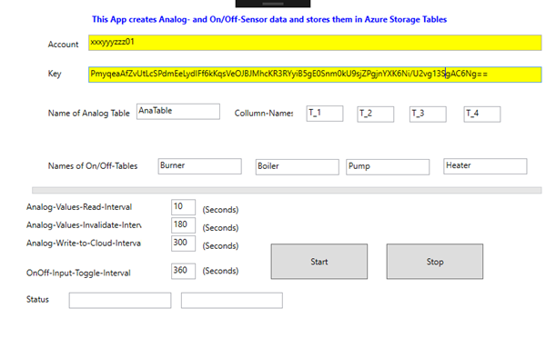

**AzureDataSender_WPF**

This App is used to send Test-Data to the Cloud.

Data stored on Azure Storage Tables can then be visulized with the iOS App Store App: ['Charts4Azure'](https://itunes.apple.com/us/app/charts4azure/id1442910354?mt=8)

